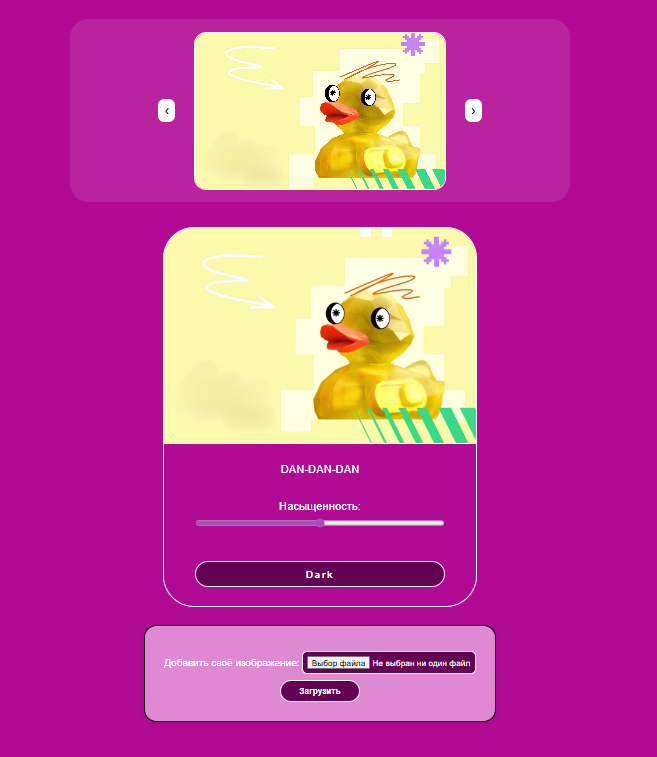
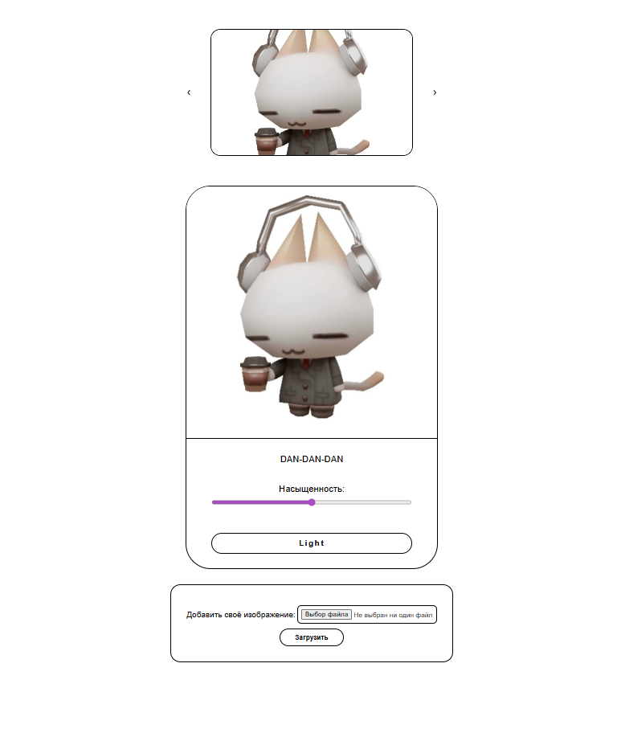

# JS DOM + Node.js — Local App with Database

Учебный проект с использованием JavaScript, Node.js и базы данных.
Разработан на 2 курсе колледжа как развитие проекта по дисциплине JS DOM.

## О проекте

Проект представляет собой веб-приложение с интерактивным интерфейсом, в котором реализована работа с DOM и подключена база данных.

Это развитие предыдущих заданий по JS DOM: теперь данные не просто изменяются на странице, а сохраняются в базе данных и обрабатываются через локальный сервер на Node.js.

## Демо



## Задача проекта
 - расширить знания по JS DOM
 - познакомиться с серверной частью на Node.js
 - реализовать хранение данных в базе данных
 - связать frontend и backend
---

## Функционал
 - интерактивная работа с DOM
 - обработка пользовательских действий
 - сохранение данных в базу данных
 - загрузка и отображение данных с сервера
 - работа с изображениями
 - взаимодействие клиента и сервера

## Технологии
 - HTML5
 - CSS3
 - JavaScript
 - Node.js
 - SQLite
---

## Роль в проекте

**Выполненные задачи:**

 - разработка клиентской части (DOM, интерфейс)
 - настройка сервера на Node.js
 - подключение и работа с базой данных
 - реализация логики взаимодействия frontend и backend
 - обработка запросов и данных
 - организация структуры проекта

## Что решает проект

**Проект демонстрирует переход от статических страниц к полноценному приложению:**

 - хранение данных вне браузера
 - работа с сервером
 - организация взаимодействия клиента и базы данных

## Практикуемые навыки
 - работа с DOM
 - обработка событий
 - основы Node.js
 - работа с SQLite
 - организация клиент-серверного взаимодействия
 - работа с файловой системой (загрузка изображений)

## Структура проекта
```
js-project-db/
├── public/
│   ├── index.html
│   ├── main.css
│   └── script.js
├── db/
│   └── images.db
├── uploads/                # загруженные файлы
├── database.js             # работа с БД
├── node.js                 # сервер Node.js
├── package.json
├── package-lock.json
```

## Запуск проекта

**Клонировать репозиторий:**
```
git clone https://github.com/Kirikiri2/js-project-db.git
cd js-project-db
```
**Установить зависимости:**
```
npm install
```
**Запустить сервер:**
```
node node.js
```
**Открыть в браузере:**
```
http://localhost:3000
```
---

## Итог

**Проект стал важным этапом в обучении:**

 - переход от чистого JavaScript к fullstack-подходу
 - понимание работы сервера и базы данных
 - создание более реалистичных веб-приложений

Этот проект подготовил основу для дальнейшего изучения backend-разработки и фреймворков (Django и Express).
